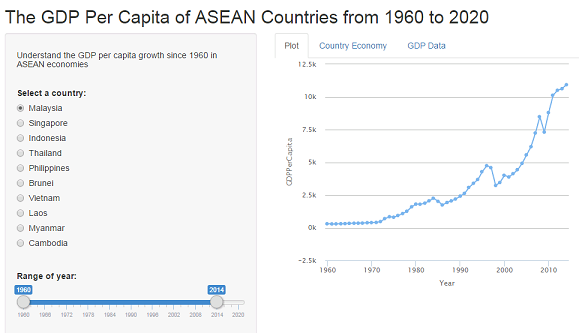

GDP Per Capita of ASEAN Economies from 1960-2020
========================================================

#### Understanding the GDP per capita growth of ASEAN economies

[View the application](https://chankf87.shinyapps.io/ASEAN_GDP_Growth/) 

Chan

10/11/2015

Introduction
========================================================

<small>The web application allows users to visualize and understand the GDP per capita growth of ASEAN economies from the year 1960 to year 2020. 

The following features are supported in this application:
* A time series graphical plot of GDP per capita
* Wikipedia pages about each country's economy
* A table of GDP per capita data

The user is provided controls to select the data to be visualized using a slider for the year range and radio buttons to choose the country.</small>


Data
========================================================

<small>The GDP per capita data for all ASEAN countries in the appplication are all based on current USD values at nominal values. This is the value of all final goods and services produced within a nation in a given year, converted at market exchange rates to current U.S. dollars, divided by the average (or mid-year) population for the same year.

Data from the year 1960 to year 2014 are extracted from [The World Bank Databank](http://databank.worldbank.org/data/home.aspx), and data from the year 2015 to year 2020 are forecast data provided by [The IMF World Economic Outlook Database](http://www.imf.org/external/pubs/ft/weo/2015/02/weodata/index.aspx).

Additional data on each country's economy are embeded from [Wikipedia](https://en.wikipedia.org).

</small>


Computation
========================================================

<small>
The charts for the GDP per capita are generated using the following code:
```
output$plot <- renderChart2({
                selected <- input$country
                country <- subset(dat, country == selected & Year %in% seq(input$range[1], input$range[2], 1))
                h1 <- hPlot(
                        x = "Year", 
                        y = "GDPPerCapita", 
                        data = country, 
                        type = "line")
        })
```
The dataset gets aggregated and displayed when a country is selected via the radio button. The radio button selection also changes the Wikipedia page to be displayed for each country's economy.</small>


Running the App
========================================================



<small>The application can be accessed online on [RStudio's Shinyapp Server](https://chankf87.shinyapps.io/ASEAN_GDP_Growth/) 

The source code of application is available from github [here](https://github.com/chankf87/devdatprod).</small>
